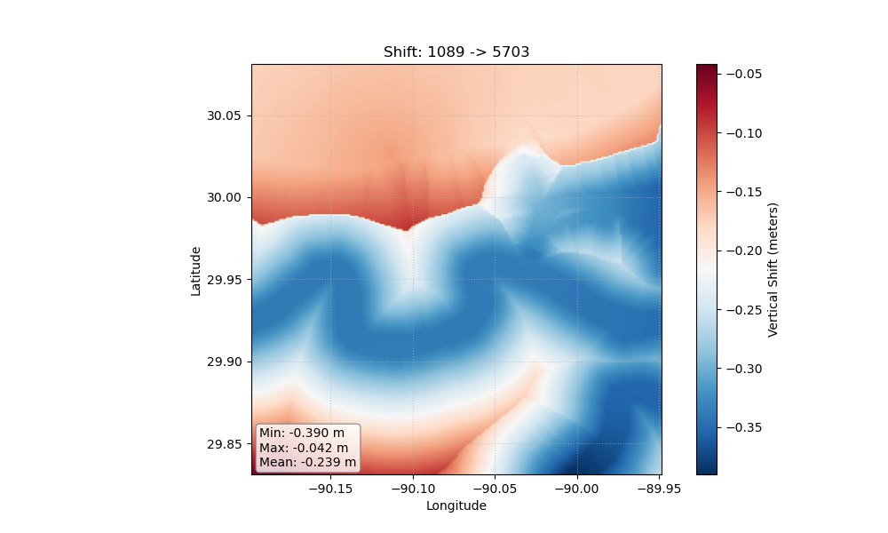

# 🌍 Transformez ↕

**Global vertical datum transformations, simplified.**

*Transformez Les Données*

> 🚀 **v0.2.2:** Now supporting global tidal transformations via FES2014 & SEANOE.

**Transformez** is a standalone Python engine for converting geospatial data between vertical datums (e.g., `MLLW` ↔ `NAVD88` ↔ `Ellipsoid`).

---


*(Above: A generated vertical shift grid transforming MLLW to NAVD88)*

## Installation

### Prerequisites: HTDP
Transformez relies on the NGS Horizontal Time-Dependent Positioning (HTDP) software to perform highly accurate plate tectonic and frame transformations. **You must install this separately.**

**For Windows:**
1. Download the pre-compiled executable (`htdp.exe`) directly from the [NOAA HTDP page](https://geodesy.noaa.gov/TOOLS/Htdp/Htdp.shtml).
2. Place `htdp.exe` in a directory that is in your system's `PATH` (e.g., `C:\Windows\System32` or a custom scripts folder).

**For Linux / macOS:**

You will need a Fortran compiler (like `gfortran`) to compile the source code.

```bash
# 1. Download the Fortran source code
wget https://geodesy.noaa.gov/TOOLS/Htdp/HTDP-download.zip
unzip HTDP-download.zip

# 2. Compile it
gfortran -o htdp htdp.f

# 3. Move it to your PATH
sudo mv htdp /usr/local/bin/
```

### Install Transformez
Once HTDP is accessible in your terminal, install the python package:

```bash
pip install transformez
```

## Usage

**Generate a vertical shift grid for anywhere on Earth.**

```bash
# Transform MLLW to WGS84 Ellipsoid in Norton Sound, AK
# (Where NOAA has no coverage!)
transformez -R -166/-164/63/64 -E 3s \
    --input-datum mllw \
    --output-datum 4979 \
    --output shift_ak.tif
```

**Transform a raster directly.** Transformez reads the bounds/resolution from the file.

```bash
transformez --dem input_bathymetry.tif \
    --input-datum "mllw" \
    --output-datum "5703:geoid=geoid12b" \
    --output output_navd88.tif
```

**Integrate directly into your download pipeline.**

```bash
# Download GEBCO and shift EGM96 to WGS84 on the fly
fetchez gebco ... --hook transformez:datum_in=5773,datum_out=4979
```

## Python API

Transformez provides a high-level API for embedding transformations directly into your Python scripts, Jupyter Notebooks, or automated pipelines.

```python
import transformez

# ---------------------------------------------------------
# Generate a Shift Grid
# ---------------------------------------------------------
# Returns a 2D numpy array. Optionally saves to a file.
# Requesting "mllw" in India triggers the Global Fallback (FES2014) automatically.

shift_array = transformez.generate_grid(
    region=[80, 85, 10, 15],  # [West, East, South, North]
    increment="3s",           # Grid resolution
    datum_in="mllw",
    datum_out="4979",         # WGS84 Ellipsoid
    out_fn="india_shift.tif"  # Optional: Save to disk
)

# ---------------------------------------------------------
# Transform an Existing Raster
# ---------------------------------------------------------
# Applies the datum shift directly to a DEM and saves the result.

out_file = transformez.transform_raster(
    input_raster="my_dem_mllw.tif",
    datum_in="mllw",
    datum_out="5703:g2012b",  # NAVD88 using specific GEOID12B
    output_raster="my_dem_navd88.tif"
)
```

## Supported Datums

* **Tidal**: mllw, mhhw, msl, lat

* **Ellipsoidal**: 4979 (WGS84), 6319 (NAD83 2011)

* **Orthometric**: 5703 (NAVD88), egm2008, egm96

* **Geoids**: g2018, g2012b, geoid09, xgeoid20b

## License

This project is licensed under the MIT License - see the [LICENSE](https://github.com/ciresdem/transformez/blob/main/LICENSE) file for details.
Copyright (c) 2010-2026 Regents of the University of Colorado