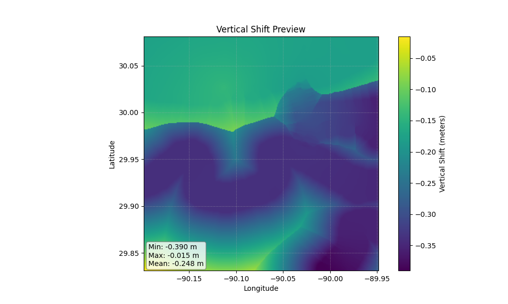

# Transformez Documentation

**Global vertical datum transformations, simplified**

*Transformez Les Données*

**Transformez** is a standalone Python engine for converting geospatial data between vertical datums (e.g., `MLLW` ↔ `NAVD88` ↔ `Ellipsoid`).

Originally developed as the core transformation engine for the [CUDEM](https://github.com/continuous-dems/cudem) project, Transformez has evolved into a standalone datum transformation suite.

## Quickstart


*(Above: A generated vertical shift grid transforming MLLW to NAVD88)*

```transformez run -R loc:"new orleans" -E 3s -I mllw -O 5703```

## Installation

### Prerequisites: HTDP
Transformez relies on the NGS Horizontal Time-Dependent Positioning (HTDP) software to perform highly accurate plate tectonic and frame transformations. **You must install this separately.**

**For Windows:**
1. Download the pre-compiled executable (`htdp.exe`) directly from the [NOAA HTDP page](https://geodesy.noaa.gov/TOOLS/Htdp/Htdp.shtml).
2. Place `htdp.exe` in a directory that is in your system's `PATH` (e.g., `C:\Windows\System32` or a custom scripts folder).

**For Linux / macOS:**

You will need a Fortran compiler (like `gfortran`) to compile the source code.

```bash
# 1. Download the Fortran source code
wget https://geodesy.noaa.gov/TOOLS/Htdp/HTDP-download.zip
unzip HTDP-download.zip

# 2. Compile it
gfortran -o htdp htdp.f

# 3. Move it to your PATH
sudo mv htdp /usr/local/bin/
```

### Install Transformez
Once HTDP is accessible in your terminal, install the python package:

```bash
pip install transformez
```

## Usage

**Generate a vertical shift grid for anywhere on Earth.**

```bash
# Transform MLLW to WGS84 Ellipsoid in Norton Sound, AK

transformez grid -R -166/-164/63/64 -E 1s -I mllw -O 4979
```

**Transform a raster directly.** Transformez reads the bounds/resolution from the file.

```bash
transformez raster my_dem.tif -I mllw -O 5703
```

**Integrate directly into your fetchez pipeline.**

```bash
# Download GEBCO and shift EGM96 to WGS84 on the fly
fetchez gebco ... --hook transformez:datum_in=5773,datum_out=4979
```

## Python API

Transformez provides a high-level API for embedding transformations directly into your Python scripts, Jupyter Notebooks, or automated pipelines.

```python
import transformez

# ---------------------------------------------------------
# Generate a Shift Grid
# ---------------------------------------------------------
# Returns a 2D numpy array. Optionally saves to a file.
# Requesting "mllw" in India triggers the Global Fallback (FES2014) automatically.

shift_array = transformez.generate_grid(
    region=[80, 85, 10, 15],  # [West, East, South, North]
    increment="3s",           # Grid resolution
    datum_in="mllw",
    datum_out="4979",         # WGS84 Ellipsoid
    out_fn="india_shift.tif"  # Optional: Save to disk
)

# ---------------------------------------------------------
# Transform an Existing Raster
# ---------------------------------------------------------
# Applies the datum shift directly to a DEM and saves the result.

out_file = transformez.transform_raster(
    input_raster="my_dem_mllw.tif",
    datum_in="mllw",
    datum_out="5703:g2012b",  # NAVD88 using specific GEOID12B
    output_raster="my_dem_navd88.tif"
)
```

## Supported Datums

🌊 **Supported Tidal Surfaces:**

| EPSG | NAME |DESC |
| --- | --- | --- |
|  1089         | mllw                        |   [USA] |
|  5866         | mllw                        |   [USA]|
|  1091         | mlw                         |   [USA]|
|  5869         | mhhw                        |   [USA]|
|  5868         | mhw                         |   [USA]|
|  5714         | msl                         |   [USA]|
|  5713         | mtl                         |   [USA]|
|  0            | crd                         |   [USA]|
|  5609         | IGLD85                      |   [USA]|
|  9000         | LWD_IGLD85                  |   [USA]|
|  5702         | NGVD29                      |   [GLOBAL]|
|  9001         | lat                         |   [GLOBAL]|
|  9002         | hat                         |   [GLOBAL]|
|  9003         | mss                         |   [GLOBAL]|

🌐 **Ellipsoidal / Frame Datums (EPSG)**:

| EPSG | NAME |DESC |
| --- | --- | --- |
|  4979         | WGS84 | World Geodetic System 1984 |
|  6319         | NAD83 | North American Datum 1983 |

🏔️  **Orthometric / Geoid-Based (EPSG)**:

| EPSG | NAME |DESC |
| --- | --- | --- |
|  5703         | NAVD88 height            |      (Default Geoid: g2018)|
|  6360         | NAVD88 height (usFt)     |      (Default Geoid: g2018)|
|  8228         | NAVD88 height (Ft)       |      (Default Geoid: g2018)|
|  6641         | PRVD02 height            |      (Default Geoid: g2018)|
|  6642         | VIVD09 height            |      (Default Geoid: g2018)|
|  6647         | CGVD2013(CGG2013)        |      (Default Geoid: CGG2013)|
|  3855         | EGM2008 height           |      (Default Geoid: egm2008)|
|  5773         | EGM96 height             |      (Default Geoid: egm96)|

🌍 **Available Geoids**:

  g2018, g2012b, geoid09, xgeoid20b, xgeoid19b, egm2008, egm96, CGG2013


```{toctree}
:maxdepth: 2
:hidden:
:caption: User Guide:

api/index
```

Indices and tables
==================

* {ref}`genindex`
* {ref}`modindex`
* {ref}`search`
