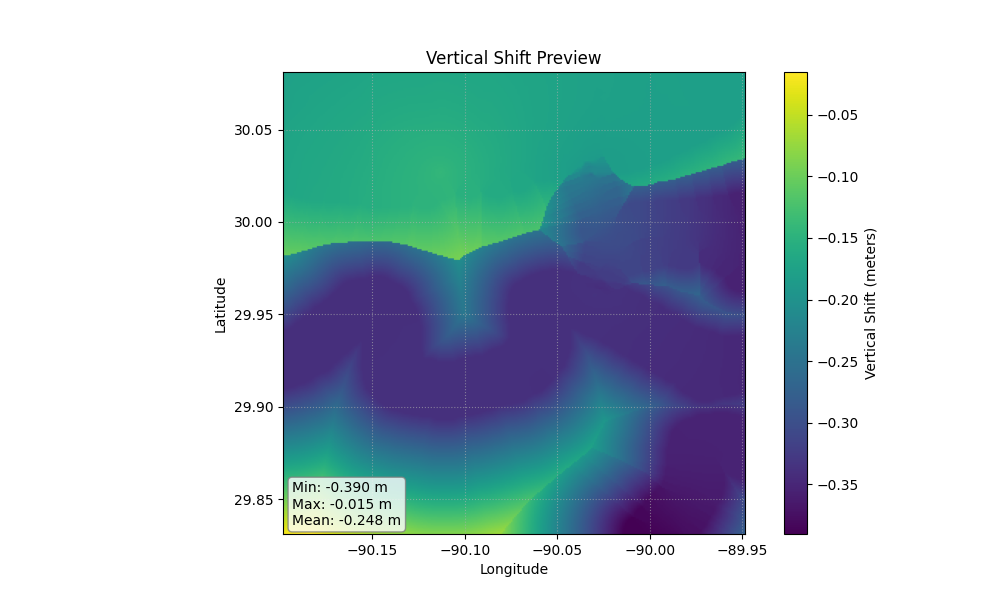

# Transformez

**Global vertical datum transformations, simplified**

**Transformez** builds and applies vertical transformations across geodetic, tidal, and model-based height references, from local datums to global surfaces.

Transformez is part of the [Continuous DEMs Project](https://continuous-dems.readthedocs.io/), an ecosystem of tools for modern, continuous digital elevation model generation.

## Key Features

- **Dynamic Hub-and-Spoke routing** — Automatically selects the optimal geodetic pathway (NAD83 or WGS84) for your transformation
- **Continuous coastal blending** — Seamlessly merges NOAA VDatum with global satellite altimetry (FES2014/DTU25)
- **Inland tidal decay** — Smart extrapolation with Hermite S-curve smoothing for flood modeling
- **Autonomous self-healing** — Automatic geoid fallbacks, corruption recovery, and HTDP tectonic fallbacks
- **Global coverage** — Works anywhere on Earth via dynamic proxy chaining when regional models are unavailable
- **Memory-safe** — Windowed I/O for transforming massive DEMs without loading them into RAM
- **CLI + Python API** — Use as a command-line tool or embed in your pipeline
- **Offline field use** — Pre-download grids with `transformez prefetch` for air-gapped environments

## Quickstart


*(Above: A generated vertical shift grid transforming MLLW to NAVD88)*

```bash
transformez build -R loc:"new orleans" -E 3s -I mllw -O 5703
```

## Installation:

```bash
pip install transformez
```

>Note: To enable matplotlib previews, install with the preview extra:
>
>```pip install transformez[preview]```

## Command Line Interface:

**Build a vertical shift grid anywhere on Earth.**

```bash
transformez build -R -166/-164/63/64 -E 1s -I vdatum:mllw -O epsg:4979
```

**Transform a raster directly.** Transformez reads the bounds/resolution from the file.

```bash
transformez shift my_dem.tif -I vdatum:mllw -O epsg:5703
```

## Python API

Transformez provides a high-level [API](api/index.md) for embedding transformations directly into your Python scripts, Jupyter Notebooks, or automated pipelines.

```python
import transformez

# Generate a Shift Grid
# Returns a 2D numpy array. Optionally saves to a file.
# Requesting "mllw" in India triggers the Global Fallback (FES2014) automatically.
shift_array = transformez.generate_grid(
    region=[80, 85, 10, 15],  # [West, East, South, North]
    increment="3s",           # Grid resolution
    datum_in="vdatum:mllw",   # Vdatums mllw realization.
    datum_out="epsg:4979",    # WGS84 Ellipsoid
    out_fn="india_shift.tif"  # Optional: Save to disk
)


# Use generation.build_shift_grid to access the ShiftGrid object directly
from transformez.grid.shift import build_shift_grid

shift = build_shift_grid(
    region=[-124.1, -124.0, 44.5, 44.6],
    increment="3s",
    datum_in="vdatum:mllw",
    datum_out="EPSG:5703",
)

print(shift.crs)
print(shift.source_reference)
print(shift.target_reference)

shift.write("mllw_to_navd88.tif")

utm_shift = shift.reproject("EPSG:32610")
utm_shift.write("mllw_to_navd88_utm.tif")


# Transform an Existing Raster
# Applies the datum shift directly to a DEM and saves the result.
out_file = transformez.transform_raster(
    input_raster="my_dem_mllw.tif",
    datum_in="vdatum:mllw",
    datum_out="5703+geoid:g2012b",  # NAVD88 using specific GEOID12B
    decay_pixels=0,                 # Set to 0 for infinite inland extrapolation (Modeling)
    output_raster="my_dem_navd88.tif"
)
```

## Learn More

Read the [User Guide](user_guide/index.md) to install Transformez, generate your first shift grid, and understand how it works — from reference inputs and the CLI/Python API through the [geodetic methodology](user_guide/methodology.md) behind the dynamic hub-and-spoke routing, sign conventions, and coastal blending.

```{toctree}
:maxdepth: 2
:hidden:
:caption: User Guide:

user_guide/index
api/index
```

Indices and tables
==================

* {ref}`genindex`
* {ref}`modindex`
* {ref}`search`
