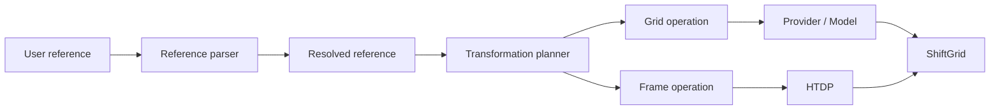
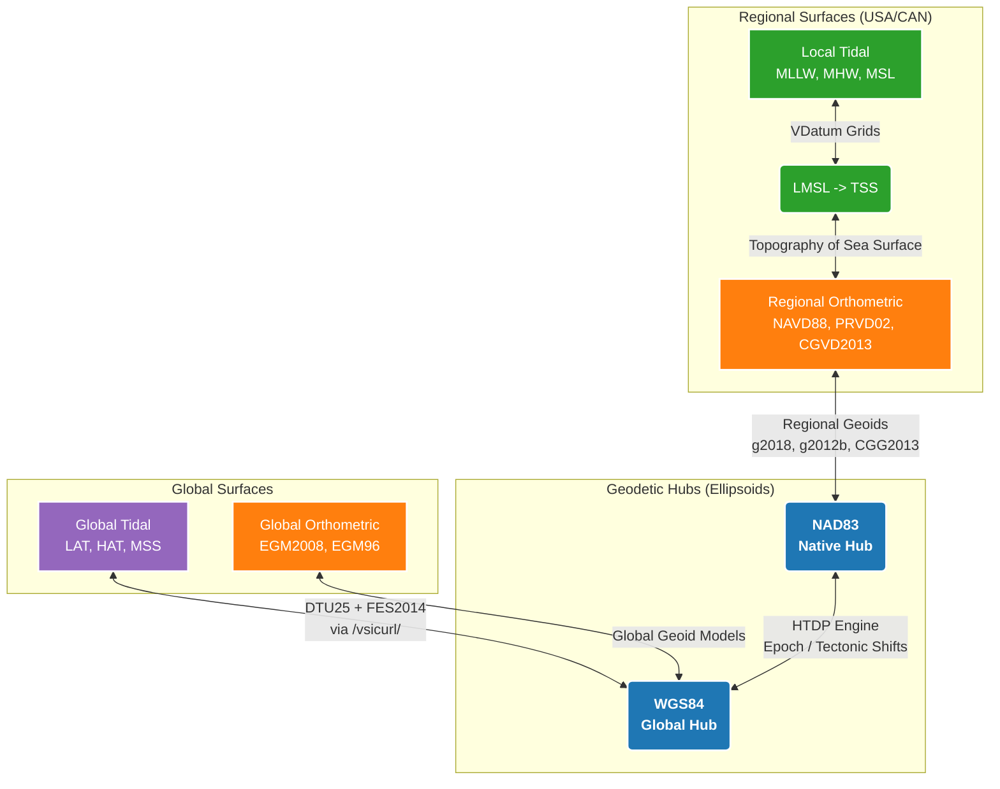

# 📐 Geodetic Methodology & Architecture
To provide vertical transformations across varied geographic extents, Transformez relies on a dynamic, rigorous architecture. The engine computes optimal geodetic pathways on the fly. Here's a look under the hood.



The engine follows a typed reference → resolution → planning → execution pipeline. A user-supplied input is parsed into separate horizontal and vertical components, resolved into its full context, planned as an explicit sequence of grid and frame operations, and only then executed, yielding a [ShiftGrid](usage.md#which-interface-do-i-want) transformation product.


## Reference Resolution
Before a transformation path is constructed, Transformez resolves user-supplied reference inputs into separate horizontal and vertical components. Standard CRS definitions are resolved through PROJ, while Transformez-specific tidal and model surfaces use explicit namespaced identifiers such as `vdatum:mllw` and `global:lat`. Legacy shorthand names are normalized to these references for backward compatibility.

Reference resolution is separate from transformation execution: parsing determines what a reference represents, and the transformation engine determines how to connect the resolved source and destination through the appropriate geodetic models and hubs. This separation lets you inspect the full plan (providers, models, hubs, and frame transformations) before any data are fetched.


## The Dynamic Hub-and-Spoke Model
Complex, multi-step vertical conversions (e.g., from a local tidal datum directly to a global geoid) are routed through an autonomous "Hub-and-Spoke" system:



| From Datum | To Datum | Hub Used | Typical Shift Direction |
|------------|----------|----------|-------------------------|
| MLLW       | NAVD88   | NAD83    | Positive (↓ to ↑)       |
| WGS84      | MLLW     | WGS84    | Negative (↑ to ↓)       |
| LAT        | MHHW     | WGS84    | Depends on location     |

* **Native Ellipsoid Hubs:** Every transformation is routed through a central geodetic frame (the "Hub").

* **Intelligent Routing:** The engine evaluates the requested input and output datums and automatically selects the safest hub.
For example, if both datums belong to the North American Datum family, the engine routes strictly through the NAD83 ellipsoid hub to avoid introducing unnecessary global transformation errors. If the request crosses international or global boundaries, it scales up to the WGS84 hub.


## The Datum Shift (Sign Conventions)
A common point of confusion in vertical geodesy is the sign convention of shift grids and what to do with them. It is easy to assume that shifting "up" to a higher surface should result in positive shift values, but physically, the opposite is true.

* **The Stick in the Bay:** Imagine standing in the water of a bay holding a measuring stick with a "zero" line marked as Mean Low Water. If you move your "zero" mark to a higher datum (e.g., moving from Mean Low Water up to Mean Higher High Water), the water level on your stick will read as a lower number.

* **The Rule of Addition:** Because of this, shifting to a higher reference surface can require positive *or* negative shift values depending on location. Transformez automatically handles these sign inversions internally so you don't have to overthink it. You always simply **ADD** the generated shift grid to your raster (i.e., `New_DEM = Old_DEM + Shift_Grid`). The grid's native positive and negative values automatically ensure the math reflects physical reality.

* **Example:**

	```python
	# Your DEM is referenced to MLLW
	dem_mllw = rasterio.open("coast_dem_mllw.tif")

	# Generate shift grid to NAVD88
	shift_grid = transformez.generate_grid(
		region=coast_region,
		datum_in="mllw",
		datum_out="navd88",
	)

	# Apply transformation
	new_dem = dem_mllw.data + shift_grid  # Always ADD
	```

## Constant Conversion or Spatial Shifts
It can be tempting to make the assumption that vertical datums are simple, flat offsets. Many GIS software and users sometimes prefer to query a single, local tide gauge, find the offset (e.g., "MLLW is exactly -1.2 meters below NAVD88"), and apply that flat, constant value across their entire dataset.

While applying a flat shift is perfectly acceptable for certain circumstances, especially very local uses (such as surveying a single, 100-foot construction pad), it introduces significant vertical errors when applied to modern geospatial data like a 50-mile coastal DEM or a hydrodynamic model.

Since water piles up and moves around and tides push into shallow bays and narrow estuaries, friction and funneling effects can cause the tidal amplitude to stretch. MLLW at the mouth of an estuary might be -1.2 meters, but ten miles up the river, MLLW might be -0.8 meters and 10 miles inland it might be 0. Because of this, tidal transformations should be spatially varying to reflect the physical laws of the ocean.


## Continuous Coastal Blending
Official tidal models (like NOAA's VDatum) provide data close to the coast. However, modern hydrodynamic modeling requires continuous grids that extend far into the deep ocean or miles inland.

* **Offshore Extrapolation:** When a requested bounding box extends beyond native VDatum coverage, Transformez automatically fetches global satellite altimetry (like DTU25 or FES2014) as a proxy.

* **Smart Blending:** To prevent harsh steps between the two models, the engine applies a dynamic spatial crossfade. Where NOAA VDatum coverage ends offshore, Transformez uses global DTU/FES-derived surfaces as a fallback and blends between valid regional and global coverage to avoid abrupt model seams. Global proxy coverage never expands the water domain; coastline geometry comes from Dist2Coast, with valid VDatum coverage permitted to extend the effective tidal domain in modeled estuaries and rivers.


## Inland Tidal Decay
Water levels (and their associated tidal datums) do not physically exist on dry land. However, coastal DEMs require inland datum extrapolation to allow storm surges to properly push water uphill during flood simulations.

1. NASA Dist2Coast provides the primary signed physical distance field.
   * positive = water
   * negative = land
   * zero = coastline-intersection cell
2. NOAA VDatum may extend the effective tidal-water domain.
   This is especially important for estuaries and tidal rivers that a coarse global coastline may classify as inland.
3. Global tidal proxies do not define the coastline.
   FES/DTU are consumers of the coastal geometry, not contributors to it.
4. Landward extrapolation is based on physical distance in meters.
   `--decay-distance 5000` means 5 km whether the DEM is 1 m, 10 m, or 3 arc-seconds.
5. A buffer can retain the full transformation before decay starts.
   `--buffer-distance 250` means full strength for the first 250 m inland.
6. A smooth Hermite/smoothstep curve attenuates the tidal component to zero.

> **⚠️ The Modeling Exception:**
>
> Hydrodynamic modelers (Tsunami, Storm Surge, Sea Level Rise) are an exception to this rule. Some tsunami, storm-surge, and inundation workflows require a continuous tidal-to-geodetic transformation over terrain that may become wetted during the simulation. For those workflows, users may choose unrestricted inland extrapolation rather than Transformez's default coastal attenuation policy.

## Fallbacks and Failures
Transformez includes explicit fallback and recovery behavior for cases where preferred models, external engines, or cached resources are unavailable.

* **Geoid Fallbacks:** If a requested geoid (like g2018) lacks physical coverage in a remote area (e.g., parts of Alaska), the engine automatically scans its registry and downgrades to the newest compatible model (like g2012b or geoid09) to keep the pipeline alive.

* **Tectonic Fallbacks:** When querying the NGS HTDP (Horizontal Time-Dependent Positioning) engine for complex plate tectonic shifts, requests crossing certain temporal epochs can fail. Transformez catches these failures and seamlessly falls back to a static datum shift at the target epoch.

* **Failure Mode Examples:**

| Failure                   | Recovery Action           |
|---------------------------|---------------------------|
| GEOID18 missing in Alaska | Fall back to GEOID12B     |
| HTDP cross-epoch fails    | Use static datum shift    |
| NetCDF corruption         | Delete cache, re-download |
| VDatum grid absent        | Use DTU/FES global proxy  |
|                           |                           |


> Deeper detail: For a step-by-step walkthrough of how NOAA VDatum regional packages are paired, normalized, and mosaiced across mixed generations of VDatum coverage, see the appendix page [VDatum Coverage Chains](vdatum_chains.md).

> Where to next: see [Validation & Accuracy](validation.md) for measured agreement against NOAA CO-OPS, VDatum, FES/DTU, and NGS HTDP.
