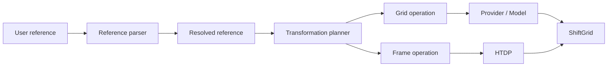
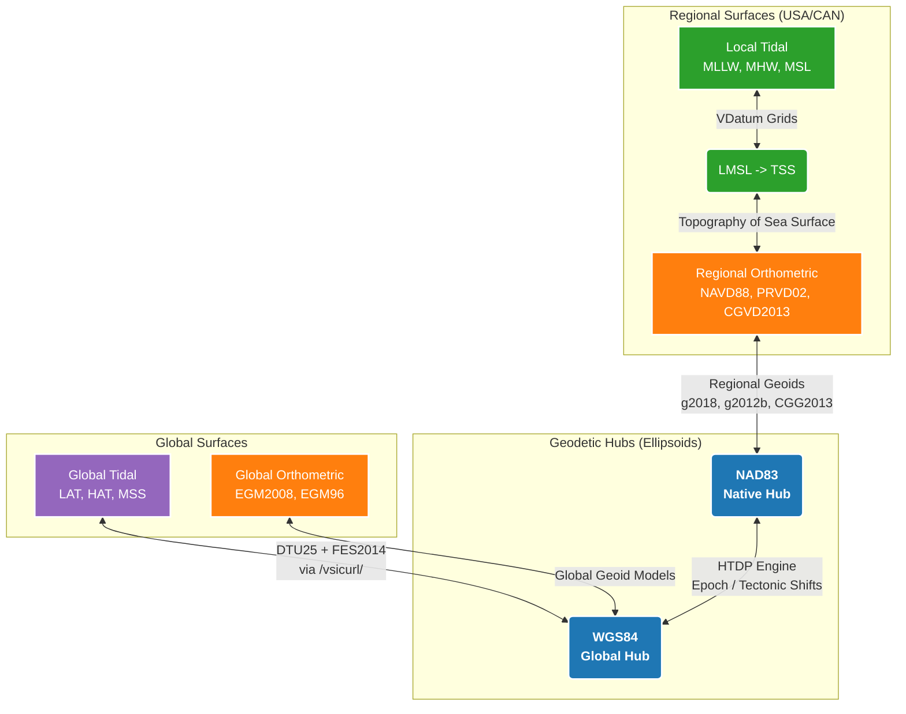

# 📐 Geodetic Methodology & Architecture
To provide vertical transformations across varied geographic extents, Transformez relies on a dynamic, rigorous architecture.
The Transformez engine computes optimal geodetic pathways on the fly.

Here is a look under the hood at how Transformez handles dynamic vertical transformations.



## Reference Resolution
Before a transformation path is constructed, Transformez resolves user-supplied coordinate-reference inputs into separate horizontal and vertical components.

Standard CRS definitions are resolved through PROJ, while Transformez-specific tidal and model surfaces use explicit namespaced identifiers such as `vdatum:mllw` and `global:lat`. Legacy shorthand names are normalized to these references for backward compatibility.

Reference resolution is separate from transformation execution, where parsing determines what a reference represents and the transformation engine determines how to connect the resolved source and destination through the appropriate geodetic models and hubs.


## The Dynamic Hub-and-Spoke Model
Transformez routes complex, multi-step vertical conversions (e.g., moving from a local tidal datum directly to a global geoid) by using an autonomous **"Hub-and-Spoke"** system



| From Datum | To Datum | Hub Used | Typical Shift Direction |
|------------|----------|----------|-------------------------|
| MLLW       | NAVD88   | NAD83    | Positive (↓ to ↑)       |
| WGS84      | MLLW     | WGS84    | Negative (↑ to ↓)       |
| LAT        | MHHW     | WGS84    | Depends on location     |

* **Native Ellipsoid Hubs:** Every transformation is mathematically routed through a central geodetic frame (the "Hub").

* **Intelligent Routing:** The engine evaluates the requested input and output datums and automatically selects the safest hub.
For example, if both datums belong to the North American Datum family, the engine routes strictly through the NAD83 ellipsoid hub to avoid introducing unnecessary global transformation errors. If the request crosses international or global boundaries, it scales up to the WGS84 hub.


## The Datum Shift (Sign Conventions)
A common point of confusion in vertical geodesy is the sign convention of shift grids and what to do with them. It is easy to assume that shifting "up" to a higher surface should result in positive shift values, but physically, the opposite is true.

* **The Stick in the Bay:** Imagine standing in the water of a bay holding a measuring stick with a "zero" line marked as Mean Low Water. If you move your "zero" mark to a higher datum (e.g., moving from Mean Low Water up to Mean Higher High Water), the water level on your stick will read as a lower number.

* **The Rule of Addition:** Because of this, shifting to a higher reference surface can require positive *or* negative shift values depending on location. Transformez automatically handles these complex sign inversions internally so you don't have to overthink it. You always simply **ADD** the generated shift grid to your raster (i.e., `New_DEM = Old_DEM + Shift_Grid`). The grid's native positive and negative values automatically ensure the math reflects physical reality.

* **Example:**

	```python
	# Your DEM is referenced to MLLW
	dem_mllw = rasterio.open("coast_dem_mllw.tif")

	# Generate shift grid to NAVD88
	shift_grid = transformez.generate_grid(
		region=coast_region,
		datum_in="mllw",
		datum_out="navd88",
	)

	# Apply transformation
	new_dem = dem_mllw.data + shift_grid  # Always ADD
	```

## Continuous Coastal Blending
Official tidal models (like NOAA's VDatum) only provide data close to the coast. However, modern hydrodynamic modeling requires continuous grids that extend far into the deep ocean or miles inland.

* **Offshore Extrapolation:** When a requested bounding box extends beyond native VDatum coverage, Transformez automatically fetches global satellite altimetry (like DTU25 or FES2014) as a proxy.

* **Smart Blending:** To prevent harsh steps between the two models, the engine applies a dynamic spatial crossfade. Where NOAA VDatum coverage ends offshore, Transformez uses global DTU/FES-derived surfaces as a fallback and blends between valid regional and global coverage to avoid abrupt model seams. Global proxy coverage never expands the water domain; coastline geometry comes from Dist2Coast, with valid VDatum coverage permitted to extend the effective tidal domain in modeled estuaries and rivers.

## VDatum coverage chains

NOAA VDatum regional packages are treated by Transformez as coherent transformation units rather than as collections of interchangeable grids.

This distinction is important because different generations of VDatum coverage do not necessarily use the same geodetic reference path. In particular, the meaning of the TSS surface depends on the horizontal reference frame recorded in the coverage metadata.

Older regional VDatum models commonly use an NAD83-based path in which the TSS surface is tied to NAVD88. More recent models may instead use IGS-based reference frames and modern xGEOID surfaces.

As a result, Transformez does not independently mosaic all tidal grids and all TSS grids before combining them. Doing so could mix surfaces from different VDatum generations that have different reference semantics.

Instead, each intersecting VDatum coverage is processed independently.

For a requested tidal datum such as `vdatum:mllw`, Transformez:

1. identifies all VDatum coverage packages that intersect the requested region;
2. pairs the requested tidal grid with the matching TSS grid from the same coverage package;
3. reads the coverage metadata to determine the TSS reference path;
4. completes the transformation chain for that coverage in its native reference system;
5. normalizes the resulting shift to the common Transformez working reference;
6. mosaics the normalized coverage with other normalized VDatum coverages according to coverage priority.

Only after this normalization are different VDatum generations allowed to overlap or fill gaps in one another.

### Legacy NAD83 / NAVD88 coverages

For legacy VDatum packages whose metadata reports an NAD83 horizontal frame, the TSS surface is treated as the LMSL-to-NAVD88 relationship.

For a tidal datum such as MLLW, the local hydrographic component is therefore:

```text
MLLW -> LMSL -> NAVD88
```

which is evaluated from the paired tidal and TSS grids as:

```text
tidal_grid - tss_grid
```

This produces a shift already expressed relative to the common NAVD88-like hydrographic working surface used by the coastal compositor.

### Modern IGS / xGEOID coverages

More recent VDatum packages may use an IGS-based reference frame.

For example, an IGS14 coverage uses xGEOID20B rather than directly tying TSS to NAVD88. The coverage must therefore be completed through its native xGEOID and ellipsoidal frame before it can be compared with older VDatum data.

Conceptually, the chain is:

```text
Tidal datum
    -> LMSL / TSS
    -> xGEOID20B
    -> IGS14 ellipsoid
    -> canonical Transformez ellipsoidal frame
    -> canonical hydrographic working surface
```

Transformez performs the appropriate HTDP frame transformation as part of this normalization.

The same architecture supports other VDatum roadmaps, such as IGS08 coverages associated with xGEOID17B.

### Coverage mosaicing

Once each coverage has been normalized to the same working reference, Transformez builds a priority mosaic.

Coverage priority is determined from the VDatum release metadata, with newer coverage preferred over older coverage. Lower-priority packages are then used only to extend the spatial coverage where higher-priority data are unavailable.

This allows, for example, a recent regional VDatum model to be preferred in its valid domain while an older regional model can still fill a genuine coverage gap outside that domain.

Very small lower-priority contributions are ignored so that isolated fringe pixels from older models do not appear through minor differences in coverage masks or shoreline boundaries.

This priority behavior is applied only after each coverage has been fully normalized. Raw grids from different VDatum generations are never allowed to compete directly.

### Coastal and global fallback

The completed VDatum mosaic represents the best available NOAA regional transformation surface for the requested area.

Where VDatum coverage remains unavailable, Transformez may continue the transformation using its coastal/global fallback model. The normalized VDatum surface is combined with the configured global proxy using coastline-aware blending, and inland behavior is handled by the normal Transformez decay model.

The overall processing order is therefore:

```text
VDatum coverage package
    -> paired tidal + TSS grids
    -> coverage-specific geodetic normalization
    -> priority mosaic of normalized coverages
    -> coastal/global fallback
    -> final geoid / reference transformation
```

This preserves the geodetic provenance of each NOAA VDatum generation while still allowing overlapping regional datasets to form a continuous transformation surface.

## Constant Conversion or Spatial Shifts
It can be tempting to make the assumption that vertical datums are simple, flat offsets. Many GIS software and users sometimes prefer to query a single, local tide gauge, find the offset (e.g., "MLLW is exactly -1.2 meters below NAVD88"), and apply that flat, constant value across their entire dataset.

While applying a flat shift is perfectly acceptable for certain circumstances, especially very local uses (such as surveying a single, 100-foot construction pad), it introduces significant vertical errors when applied to modern geospatial data like a 50-mile coastal DEM or a hydrodynamic model.

Since water piles up and moves around and tides push into shallow bays and narrow estuaries, friction and funneling effects can cause the tidal amplitude to stretch. MLLW at the mouth of an estuary might be -1.2 meters, but ten miles up the river, MLLW might be -0.8 meters and 10 miles inland it might be 0. Because of this, tidal transformations should be spatially varying to reflect the physical laws of the ocean.


## Inland Tidal Decay
Water levels (and their associated tidal datums) do not physically exist on dry land. However, coastal DEMs require inland datum extrapolation to allow storm surges to properly push water uphill during flood simulations.

1. NASA Dist2Coast provides the primary signed physical distance field.
   * positive = water
   * negative = land
   * zero = coastline-intersection cell
2. NOAA VDatum may extend the effective tidal-water domain.
   This is especially important for estuaries and tidal rivers that a coarse global coastline may classify as inland.
3. Global tidal proxies do not define the coastline.
   FES/DTU are consumers of the coastal geometry, not contributors to it.
4. Landward extrapolation is based on physical distance in meters.
   `--decay-distance 5000` means 5 km whether the DEM is 1 m, 10 m, or 3 arc-seconds.
5. A buffer can retain the full transformation before decay starts.
   `--buffer-distance 250` means full strength for the first 250 m inland.
6. A smooth Hermite/smoothstep curve attenuates the tidal component to zero.

> **⚠️ The Modeling Exception:**
>
> Hydrodynamic modelers (Tsunami, Storm Surge, Sea Level Rise) are an exception to this rule. Some tsunami, storm-surge, and inundation workflows require a continuous tidal-to-geodetic transformation over terrain that may become wetted during the simulation. For those workflows, users may choose unrestricted inland extrapolation rather than Transformez's default coastal attenuation policy.

## Autonomous Self-Healing
Transformez is designed to survive infrastructure failures automatically:

* **Geoid Fallbacks:** If a requested geoid (like g2018) lacks physical coverage in a remote area (e.g., parts of Alaska), the engine automatically scans its registry and downgrades to the newest compatible model (like g2012b or geoid09) to keep the pipeline alive.

* **Tectonic Fallbacks:** When querying the NGS HTDP (Horizontal Time-Dependent Positioning) engine for complex plate tectonic shifts, requests crossing certain temporal epochs can fail. Transformez catches these failures and seamlessly falls back to a static datum shift at the target epoch.

* **Failure Mode Examples:**

| Failure                   | Recovery Action           | User Impact                                  |
|---------------------------|---------------------------|----------------------------------------------|
| GEOID18 missing in Alaska | Fall back to GEOID12B     | None—automatic                               |
| HTDP cross-epoch fails    | Use static datum shift    | Slight precision loss                        |
| NetCDF corruption         | Delete cache, re-download | Automatic retry                              |
| VDatum grid absent        | Use DTU/FES global proxy  | Lower regional fidelity; continuous fallback |
|                           |                           |                                              |

---

## Getting Started

Ready to transform your data?

```bash
# Install
pip install transformez

# Generate a shift grid
transformez run -R loc:"Miami" -E 1s -I mllw -O navd88 -o shift_grid.tif

# Transform a DEM directly
transformez run my_dem.tif -I mllw -O navd88 -o my_dem_navd88.tif

# Learn more
transformez --help
transformez list  # View all supported datums
```
