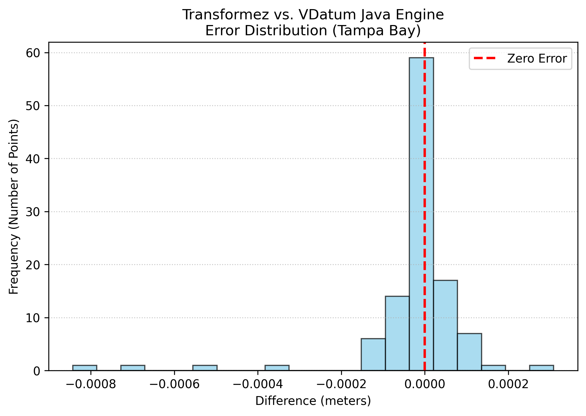

# Validation & Accuracy

Geodetic transformations require extreme precision. To ensure `transformez` is mathematically sound and safe for production pipelines, we continuously run it through a gauntlet of validation tests.

We test against real-world tide gauges (ground truth), legacy geodetic software (engine-to-engine comparison), and global satellite models.

## Test 1: Ground Truth (NOAA CO-OPS Tide Stations)

The ultimate test of a hydrodynamic model is how well it matches physical water levels at the coast. In this test, we dynamically generate a transformation grid (MSL to MLLW) and query the resulting shifts against the official offsets reported by the **NOAA CO-OPS API**.

We validated across three highly complex physical environments:

1. **Chesapeake Bay:** A massive, winding estuary with complex inland tidal decay.
2. **Astoria, OR:** A riverine environment heavily impacted by the Pacific Ocean.
3. **Norton Sound, AK:** Extremely shallow water utilizing our dynamic global fallback.

| Region | RMSE | Mean Bias | Physical Challenge |
| :--- | :--- | :--- | :--- |
| **Chesapeake Bay** | ~ 0.0503 m | ~ -0.0018 m | Estuary Shoaling |
| **Astoria, OR** | ~ 0.0279 m | ~ 0.0044 m | River Dynamics |
| **Norton Sound, AK** | ~ 0.4638 m | ~ -0.6171 m | Shallow Shelf Friction |

<!-- 
 -->
<!--    -->
<!-- 
 -->

<!-- 
 -->
<!--    -->
<!-- 
 -->

<!-- 
 -->
<!--    -->
<!-- 
 -->

*Notice how tightly the calculated grids adhere to the 1:1 perfect match line, even as the tidal amplitude grows.*

## Test 2: Engine vs. Engine (NOAA VDatum)

While matching physical tide stations is critical, it is equally important that our internal math (handling EPSG codes, unit scaling, and grid compositing) matches the official standard.

We tested `transformez` directly against the **NOAA VDatum Java CLI** by generating 100 random offshore coordinates in Tampa Bay, Florida, and translating them from NAVD88 to MLLW usingxs both engines.

| Metric | Value |
| :--- | :--- |
| **RMSE** | < 0.001 m |
| **Mean Difference** | 0.000 m |
| **Points Tested** | 109 |

<!-- 
 -->
<!--    -->
<!-- 
 -->

As the histogram shows, the difference between `transformez` and the legacy Java executable is effectively zero. The only minor deviations (in the millimeter range) are due to our use of modern bilinear interpolation near grid boundaries.

## Test 3: Global Reach (FES2014 Altimetry)

Because `transformez` is designed for global DEMs (like ETOPO), we must validate its behavior outside the United States. When requested to transform tidal datums internationally, the engine falls back to the **FES2014** satellite altimetry model, applying deep-water symmetry where necessary.

We compared our on-the-fly LAT-to-MSL calculations against the official historical records of three famous international tide gauges.

<!-- 
 -->
<!--    -->
<!-- 
 -->

Even across wildly different tidal regimes—from the massive 3.6 meter drop in France to the sub-meter shift in Australia—the satellite-derived transformation aligns with the physical coastal gauges.

## Conclusion

Whether you are converting local survey points or generating continent-wide DEMs, you can trust that `transformez` honors the underlying geodetic physics with the same rigor as the official scientific agencies.
