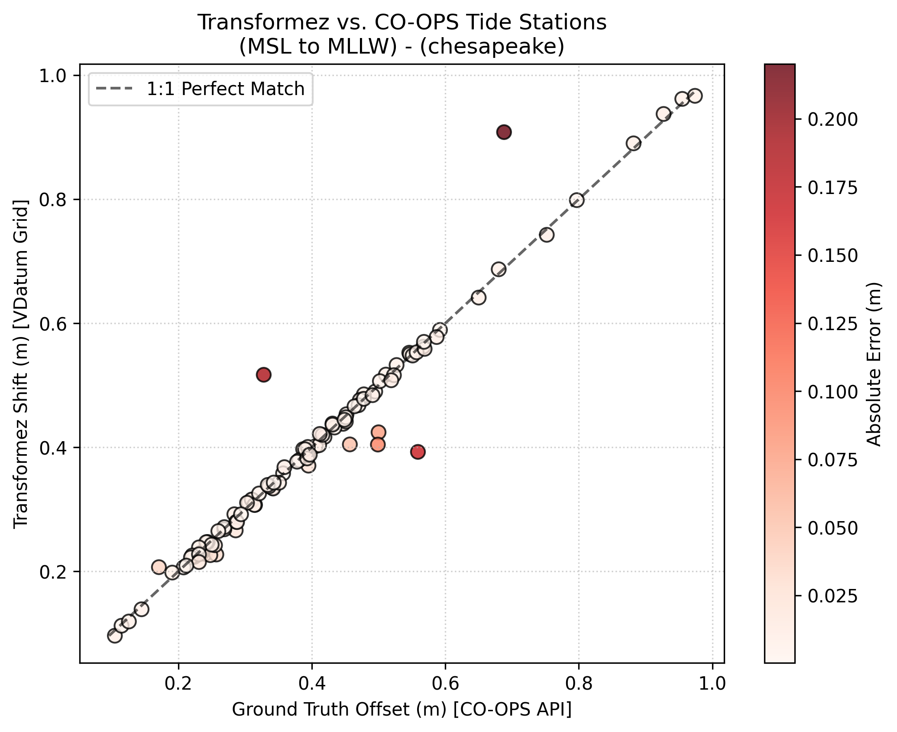
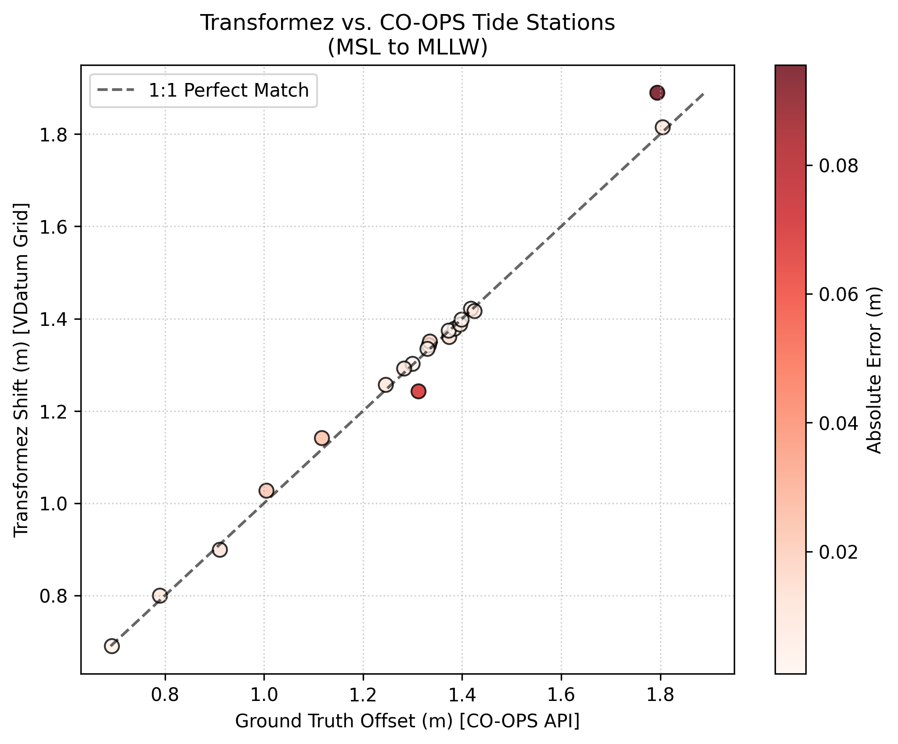
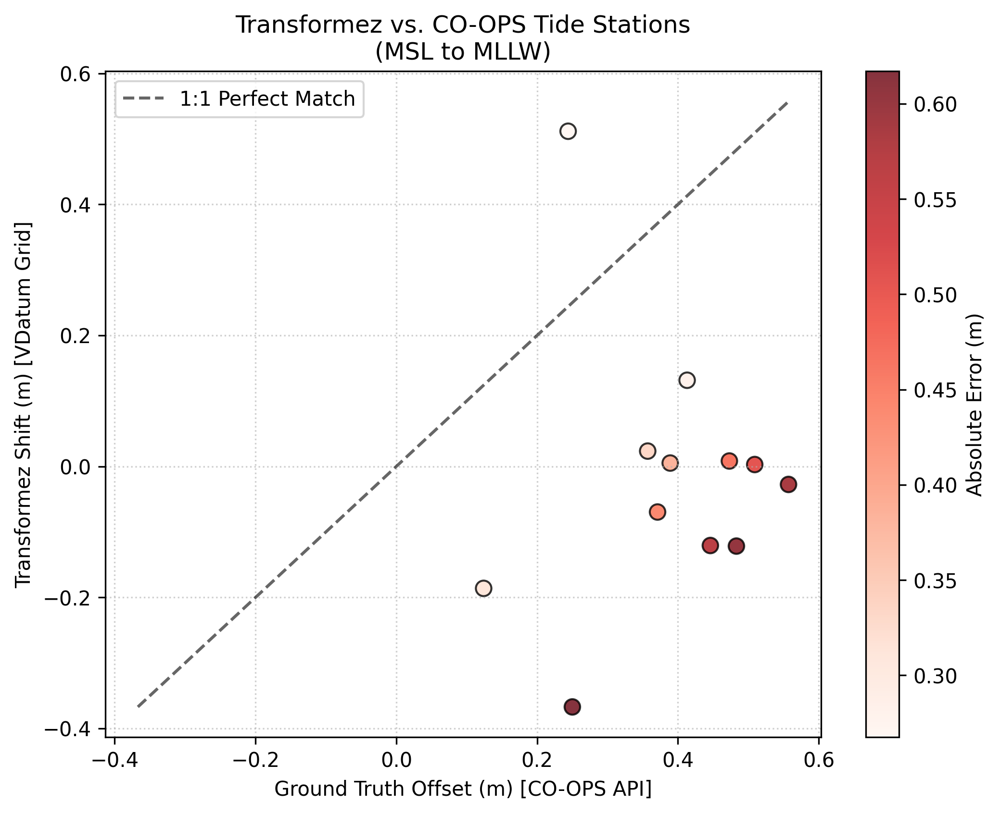
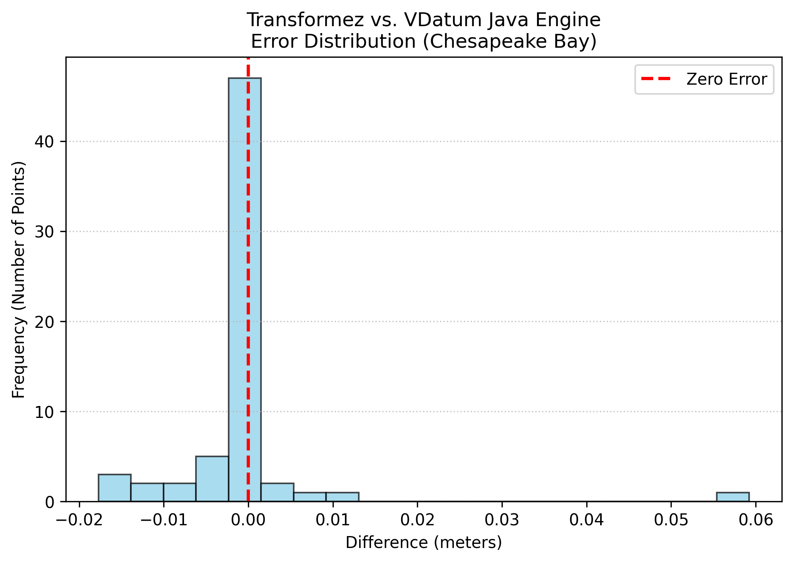
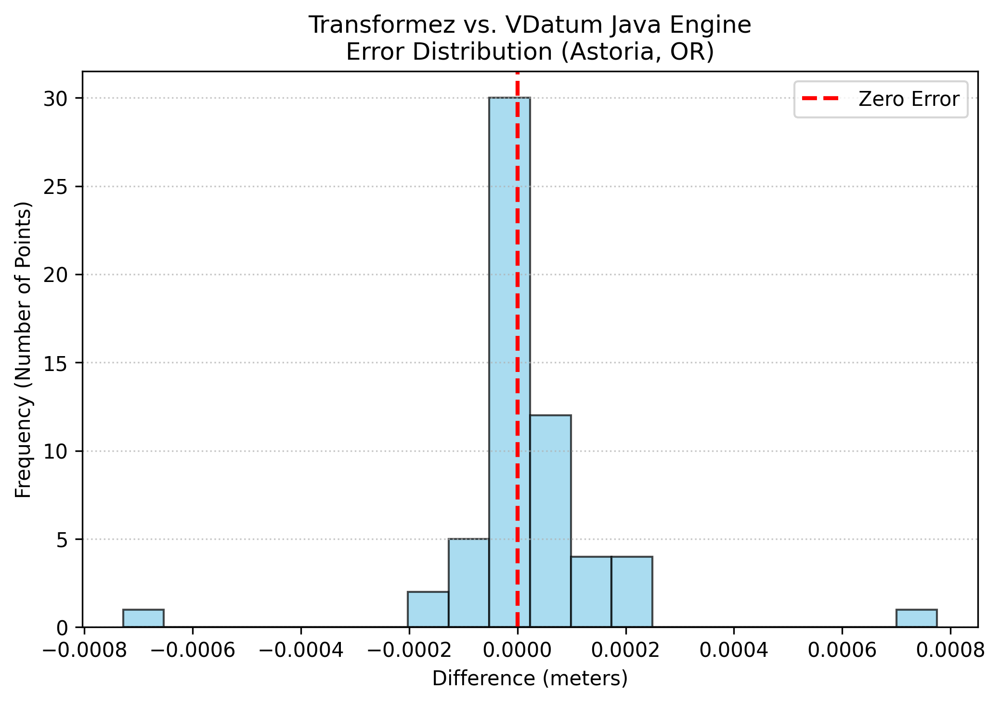
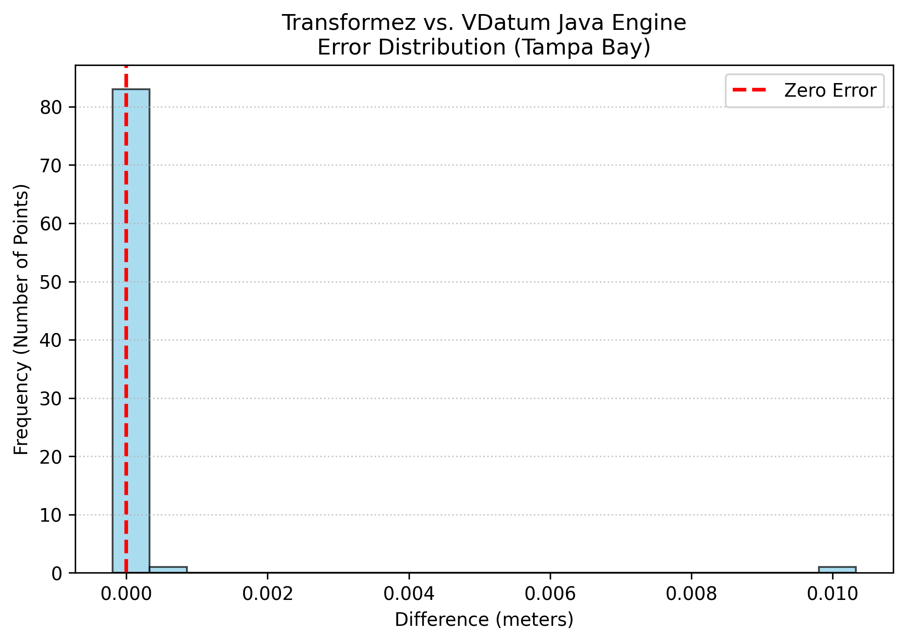
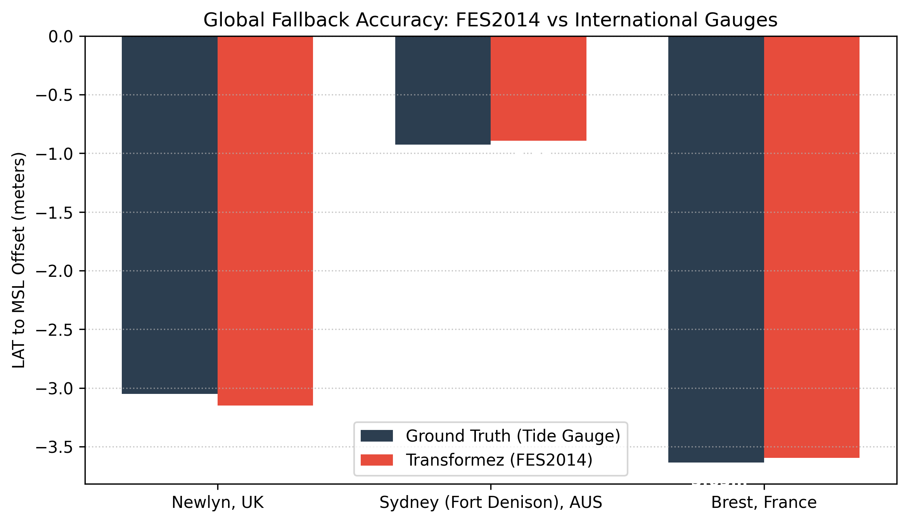

# Validation & Accuracy

Geodetic transformations require extreme precision. To ensure `transformez` is mathematically safe and sound for production pipelines, we continuously run it through a gauntlet of validation tests.

We test against real-world tide gauges (ground truth), geodetic software (engine-to-engine comparison), and global satellite models.

## Test 1: Ground Truth (NOAA CO-OPS Tide Stations)

In this test, we dynamically generate a transformation grid (MSL to MLLW) and query the resulting shifts against the official offsets reported by the **NOAA CO-OPS API**.

We validated across three complex physical environments:

1. **Chesapeake Bay:** A massive, winding estuary with complex inland tidal decay.
2. **Astoria, OR:** A riverine environment heavily impacted by the Pacific Ocean.
3. **Norton Sound, AK:** Extremely shallow water utilizing our dynamic global fallback.

| Region | RMSE | Mean Bias | Physical Challenge |
| :--- | :--- | :--- | :--- |
| **Chesapeake Bay** | ~ 0.0363 m | ~ -0.0012 m | Estuary Shoaling |
| **Astoria, OR** | ~ 0.0462 m | ~ 0.0071 m | River Dynamics |
| **Norton Sound, AK** | ~ 0.4638 m | ~ -0.4022 m | Shallow Shelf Friction/No VDatum coverage |

<!-- 
 -->
<!--    -->
<!-- 
 -->

<!-- 
 -->
<!--    -->
<!-- 
 -->

<!-- 
 -->
<!--    -->
<!-- 
 -->

## Test 2: Engine vs. Engine (NOAA VDatum)

In this test we tested `transformez` directly against the **NOAA VDatum Java CLI** by generating random offshore coordinates and translating them from NAVD88 to MHW using both engines.

| Region | RMSE | Mean Difference | Random Points |
| :--- | :--- | :--- | :--- |
| **Chesapeake Bay** | ~ 0.0089 | ~0.0006 m | 64 |
| **Astoria, OR** | ~ 0.0002 m | ~ 0.0000 m | 59 |
| **Tampa Bay, FL** | ~ 0.0011 m | ~ -0.0001 m |  85 |

As the histogram shows, the difference between `transformez` and the VDatum Java executable is effectively zero. The only minor deviations (in the millimeter range) are due to our use of modern bilinear interpolation near grid boundaries and floating point error.

## Test 3: Global Reach (FES2014 Altimetry)

Because `transformez` is designed for global DEMs (like ETOPO), we must validate its behavior outside the United States. When requested to transform tidal datums internationally, the engine falls back to the **FES2014** satellite altimetry model, applying deep-water symmetry where necessary.

In this test, we compared our on-the-fly LAT-to-MSL calculations against the official historical records of three famous international tide gauges.

* [Newlyn, UK](https://ntslf.org/tides/datum)
* [Sydney, AUS](https://nla.gov.au/nla.obj-3727981193/view)
* [Brestm FR](https://diffusion.shom.fr/donnees/references-verticales/references-altimetriques-maritimes-ram.html)

<!-- 
 -->
<!--    -->
<!-- 
 -->

Even across wildly different tidal regimes, from the 3.6 meter drop in France to the sub-meter shift in Australia, the satellite-derived transformation aligns with the physical coastal gauges.

## Conclusion

Whether you are converting local survey points or generating continent-wide DEMs, you can trust that `transformez` honors the underlying geodetic physics with the same rigor as the official scientific agencies.
