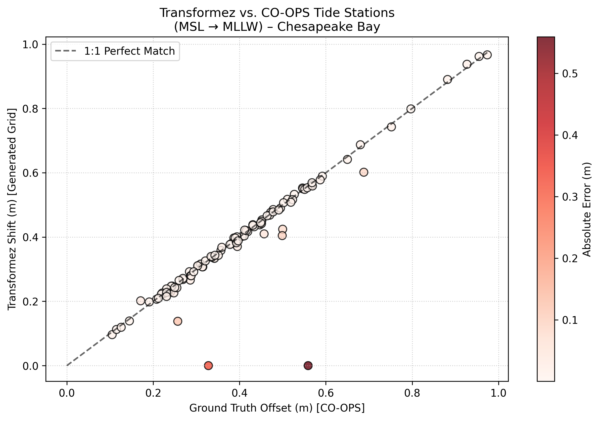
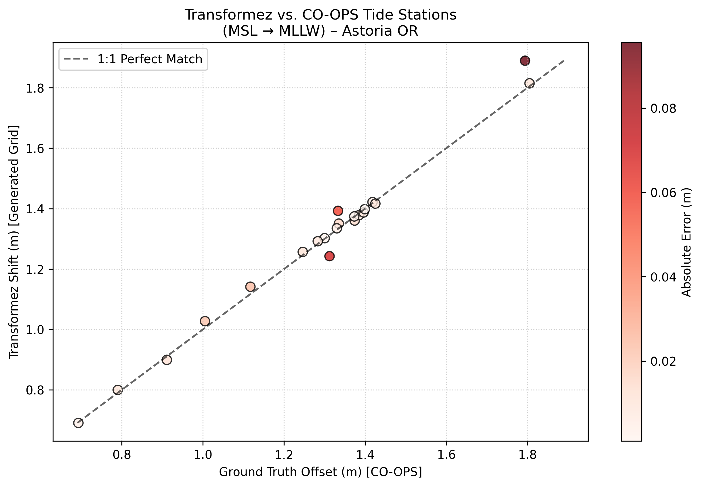
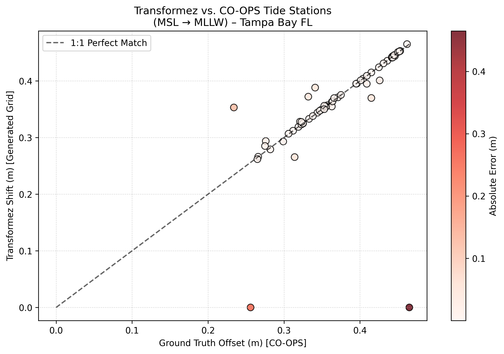
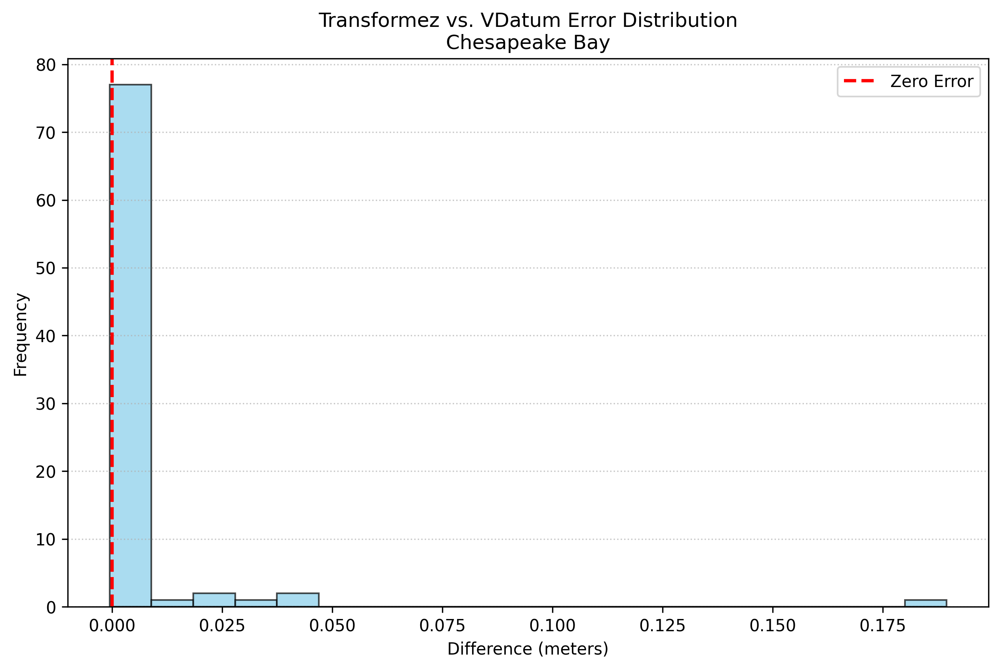
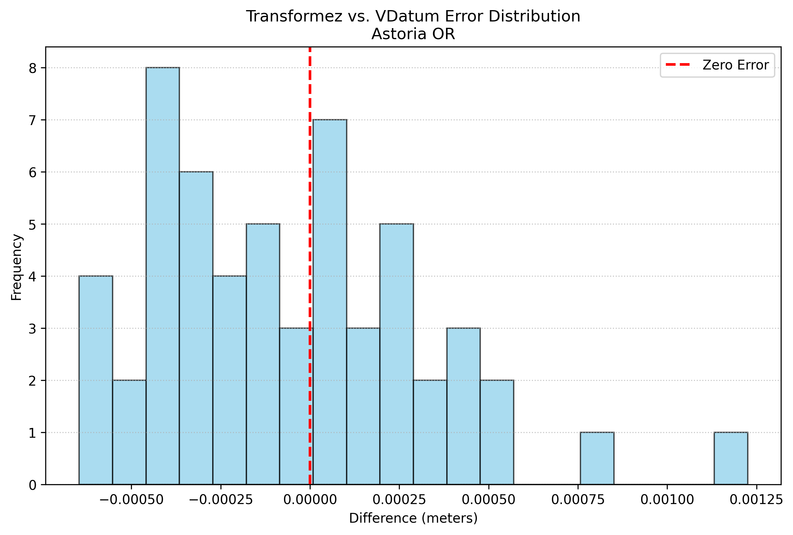
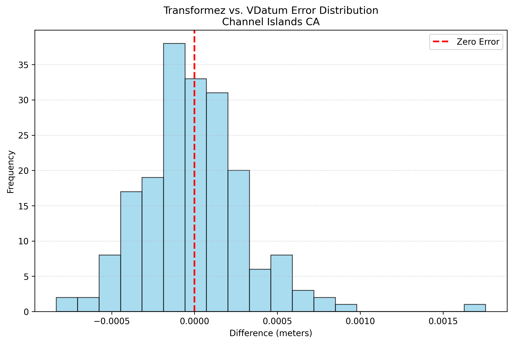
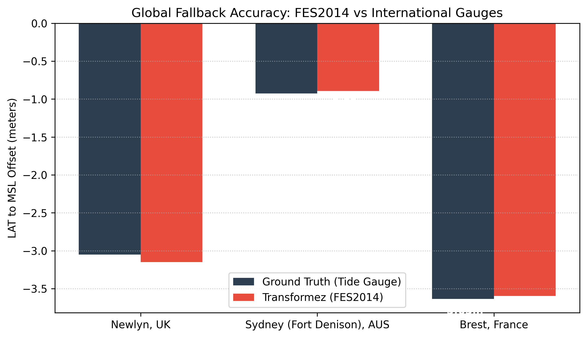

# 🏹 Validation & Accuracy

Transformez is validated at several different levels because no single benchmark can fully describe the behavior of a coastal vertical-datum transformation engine. The tests below separate provider/grid accuracy, production coastal behavior, global-model agreement, and external HTDP integration.

These results should therefore be interpreted according to the purpose of each test rather than as interchangeable measures of a single global accuracy value. In particular, the NOAA CO-OPS station comparison includes Transformez's production shoreline, coverage, and inland-decay policy, while the NOAA VDatum comparison intentionally removes those effects to isolate numerical engine equivalence.

## Validation Environment

The versions below record the Python packages and external geodetic engines resolved for this validation run. External-engine paths are included because HTDP and VDatum may be installed in multiple locations, and their software/data generation can materially affect reproducibility.

| Component | Version | Source |
| :--- | :--- | :--- |
| **Transformez** | 1.0.0 | python environment |
| **Fetchez** | 0.8.7 | python environment |
| **HTDP** | 3.6.0 | resolved by Transformez |
| **VDatum** | 4.8 | user |

> **Reproducibility note:** Transformez and Fetchez versions identify the Python implementation under test. HTDP and VDatum identify the external reference engines used by Tests 2 and 4; their resolved paths are recorded to make it explicit which managed or system installation was selected.

## Test 1: Production Coastal Surface vs. NOAA CO-OPS Tide Stations

This test generates a 3 arc-second MSL → MLLW shift grid using the normal Transformez coastal policy and samples it at NOAA CO-OPS tide-station locations. The comparison therefore evaluates the complete production surface, not only the underlying VDatum transformation mathematics.

The validation uses a 250 m full-strength coastal buffer followed by a 5.0 km inland decay. Valid VDatum coverage, the Dist2Coast-derived effective water domain, raster sampling, shoreline geometry, and coastal fallback behavior can all influence individual station comparisons.

CO-OPS stations are point observations intentionally located in the tidal environment, whereas Transformez produces a continuous raster intended for DEM transformation. A gauge may sit on a pier, seawall, narrow creek, harbor edge, or mixed land/water raster cell. For that reason, RMSE in this test should be interpreted as an operational coastal-surface metric rather than a direct estimate of the numerical error of the datum engine itself.

Small mean bias together with larger RMSE generally indicates local spatial scatter near complex coastlines rather than a systematic datum offset. Changes in shoreline representation can also change this benchmark without changing the underlying datum transformation; earlier Transformez validation used GSHHG vector coastlines, while the current production engine uses the Dist2Coast-based coastal context.

| Region | RMSE | Mean Bias | Stations | Physical Challenge |
| :--- | :--- | :--- | :--- | :--- |
| **Chesapeake Bay** | 0.0669 m | -0.0138 m | 104 | Estuary Shoaling |
| **Astoria OR** | 0.0307 m | 0.0068 m | 21 | River Dynamics |
| **Tampa Bay FL** | 0.0714 m | -0.0104 m | 60 | Complex Bay Geometry |

> **How to read this test:** These values include Transformez's coastal masking and decay policy. They are expected to be more sensitive in estuaries and geometrically complex bays than in broad, well-resolved waterways. They should not be compared directly with the engine-equivalence RMSE in Test 2.

## Test 2: Numerical Comparison vs. NOAA VDatum

This test compares Transformez directly against the NOAA VDatum Java CLI at random locations for a NAVD88 → MHW transformation. Inland attenuation is deliberately disabled so that coastal decay policy does not contaminate the numerical comparison.

The purpose of this test is to verify that Transformez follows the same underlying geodetic transformation logic as NOAA VDatum, not to require bit-for-bit identity with the VDatum application. Where both engines evaluate the same regional package and transformation path, agreement should generally approach interpolation precision. Small residual differences can still arise because Transformez and VDatum do not necessarily use identical backend software versions, regional package-selection rules, or raster-compositing strategies.

Modern NOAA VDatum coverages can differ substantially from legacy packages. Older regional packages may express the tidal-to-TSS relationship directly against NAVD88, while newer packages can be tied to IGS realizations and require an xGEOID model plus a frame transformation before they can be compared with NAVD88-based surfaces. Transformez preserves each package as a coherent tidal/TSS unit, completes its package-specific path to the appropriate ellipsoid, applies the required HTDP frame transformation, converts to a common orthometric working surface, and only then mosaics multiple normalized coverages.

This distinction matters in regions containing mixed generations of VDatum data. Transformez is designed to build one continuous shift surface suitable for DEM transformation, so overlapping legacy NAVD88-based and modern xGEOID-based coverages may both contribute to a single output grid. NOAA VDatum, by contrast, evaluates its own internal regional selection logic for each requested point. Both approaches use valid NOAA transformation resources, but they need not select the same source package in an overlap.

Coverage ordering is therefore an important source of explainable disagreement. Transformez applies a deterministic general priority rule based primarily on release recency and geographic specificity, while NOAA VDatum can use more detailed provider-specific knowledge about adjacent or overlapping regional datasets. In areas such as Chesapeake Bay, neighboring VDatum packages from the same release can overlap substantially and differ locally by several centimeters; selecting a different valid package in that overlap can increase RMSE even when the transformation chain for each individual package is correct.

Backend version differences can also contribute. Transformez resolves and records the HTDP version it uses for frame transformations, while a given VDatum release may embed or depend on a different HTDP generation or transformation implementation. The validation environment table above is therefore part of the numerical result: a small discrepancy between Transformez and VDatum can reflect a reproducible difference between the two software stacks rather than an error in either one.

The Channel Islands case is intentionally included as a mixed-generation coverage-chain stress test. Southern California contains overlapping legacy NAD83/NAVD88-based coverage and newer IGS/xGEOID coverage. Transformez must keep tidal and TSS grids from the same package together, normalize the modern package through xGEOID and HTDP, apply release priority, and then mosaic the normalized surfaces. The island shorelines additionally expose small coverage-mask differences that can otherwise allow isolated lower-priority fringe cells to leak through newer coverage.

The Chesapeake Bay case exercises an even denser overlap environment, with numerous adjacent and overlapping modern and legacy packages. Larger residuals there are therefore interpreted together with the package topology: they may reflect valid but different overlap choices rather than a disagreement in the underlying vertical-datum mathematics.

| Region | VDatum Region | RMSE | Mean Difference | Points | Validation Challenge |
| :--- | :--- | :--- | :--- | :--- | :--- |
| **Chesapeake Bay** | 5 | 0.023705 m | 0.008765 m | 84 | Estuary Shoaling |
| **Astoria OR** | 6 | 0.002611 m | 0.002592 m | 56 | River Dynamics |
| **Tampa Bay FL** | 4 | 0.000365 m | -0.000049 m | 94 | Complex Bay Geometry |
| **Channel Islands CA** | 6 | 0.002810 m | 0.002795 m | 191 | Overlapping Legacy and Modern VDatum Coverage Chains |

> **How to read this test:** This is a numerical implementation comparison, not a requirement for one-to-one reproduction of every internal VDatum software decision. Near-zero differences indicate that Transformez and VDatum evaluated effectively the same package and path. Larger localized differences, especially in dense overlap regions, should be interpreted in the context of package selection, mixed xGEOID/NAVD88 mosaicing, backend HTDP versions, grid interpolation, and each engine's overlap policy. The Channel Islands result is a regression check on mixed-generation package pairing and xGEOID/frame normalization; Chesapeake Bay additionally stresses multi-package overlap ordering.

## Test 3: Global Model Agreement at International Tide Gauges

Outside NOAA VDatum coverage, Transformez uses global ocean-surface models to provide a physically meaningful transformation path. This test evaluates that global-model strategy by comparing the modeled LAT → mean-sea-surface offset with published offsets at selected international tide gauges.

This is not an engine-equivalence test: the reference station values and the gridded global models are independent representations of the local tidal regime. Differences therefore include the spatial resolution and physics of the global model, local harbor and coastal effects, station realization, and raster sampling. The purpose is to verify that Transformez selects and combines the global models correctly and that the resulting offsets remain physically consistent with observed station values across very different tidal environments.

| Station | Published Offset | Transformez | Delta |
| :--- | :--- | :--- | :--- |

> **How to read this test:** Agreement at the decimeter scale is meaningful here because the comparison is between a gridded global ocean model and local station realizations, not two implementations of the same transformation grid. The test is primarily a validation of global fallback selection and physical plausibility.

## Test 4: HTDP Integration Health Check

Transformez uses NGS HTDP for transformations between supported dynamic and plate-fixed reference frames and for coordinate-epoch changes. These checks verify that the external HTDP executable can be called successfully, that Transformez passes the expected frame and epoch information, and that longitude handling works in both western and eastern hemispheres.

These tests are best understood as integration or regression checks rather than independent geodetic validation of HTDP itself. NGS HTDP is the authoritative model being executed; Transformez is verifying that its wrapper and execution path invoke it correctly.

| Test Region | Calculated Shift | Challenge | Status |
| :--- | :--- | :--- | :--- |
| **Washington (Cross-Epoch)** | -0.2610 m | Crustal Velocity & Datum Offset | PASS |
| **Japan (East Longitude)** | 1.9530 m | Eastern Hemisphere Longitude Parsing | PASS |

> **How to read this test:** PASS indicates that the HTDP integration produced a plausible, finite result through the expected execution path. Detailed verification of HTDP's geophysical model belongs to NGS; these cases primarily protect Transformez against wrapper, frame-ID, epoch, and longitude-regression errors.

## Overall Interpretation

Taken together, the validation suite tests different layers of Transformez rather than reducing accuracy to a single number:

- **NOAA CO-OPS station tests** exercise the complete production coastal surface, including shoreline classification, VDatum coverage, raster resolution, and inland-decay policy.
- **NOAA VDatum engine comparisons** verify that Transformez follows the same underlying transformation logic while also exposing expected differences caused by mixed-generation mosaicing, overlap selection, backend software versions, and interpolation policy.
- **International gauge comparisons** test whether the global fallback models produce physically reasonable offsets where local VDatum grids are unavailable.
- **HTDP checks** verify the external frame/epoch transformation integration and guard against execution regressions.

A larger RMSE in a complex estuary does not by itself indicate a datum-engine error. In heavily overlapped VDatum regions, Transformez and the VDatum application may legitimately select different valid regional packages, and modern xGEOID-based chains may also traverse different backend software versions than older NAVD88-based paths. The validation results are therefore interpreted spatially and operationally rather than as a requirement that Transformez duplicate every internal VDatum selection decision. Coastal validation remains intentionally sensitive to the production shoreline and compositing model because that behavior is part of the continuous surface Transformez ultimately applies to DEMs.

> **Reproduce these results:** All validation scripts are in [`tests/validation/`](https://github.com/continuous-dems/transformez/tree/main/tests/validation)
